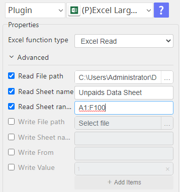
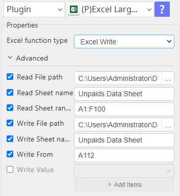
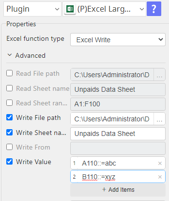

# Excel Large Files

***Excel Large Files with this plug-in read large xlsx file and write large xlsx file.***

## Excel Large Files
| Item         |               Value               |
|--------------|:---------------------------------:|
| Icon         |     |
| Display Name |       **Excel Large Files**       |

### Arun Kumar (arunk@argos-labs.com)

Arun Kumar
* [Email](mailto:arunk@argos-labs.com) 
 
## Version Control 
* [5.1102.1305](setup.yaml)
* Release Date: `November 02, 2023`

## Input (Required)
| OP Type      | Parameters                  | Output                |
|--------------|-----------------------------|-----------------------|
| Excel Read   | Read File path              | col_val               |
|              | Read Sheet name             |                       |
|              | Read Sheet range (optional) |                       |
| Excel Read   | Read File path              | count                 |
|              | Read Sheet name             |                       |
|              | Count Row                   |                       |
| Excel Write  | Read File path              | last_col,write_excel  |
|              | Read Sheet name             |                       |
|              | Read Sheet range (optional) |                       |
|              | Write File path             |                       |
|              | Write Sheet name            |                       |
|              | Write From                  |                       |
| Excel Write  | Write File path             | last_col,write_excel  |
|              | Write Sheet name            |                       |
|              | Write Value                 |                       |

## Return Value

### Normal Case
Description of the output result

## Return Code
| Code | Meaning                      |
|------|------------------------------|
| 0    | Success                      |
| 1    | Exceptional case             |

## Output Format
You may choose one of 3 output formats below,

<ul>
  <li>String (default)</li>
  <li>CSV</li>
  <li>File</li>
</ul>  

## Parameter setting examples (diagrams)

## Operations

### Read Excel:

### Write Excel from other excel:

### Write Excel by value:

